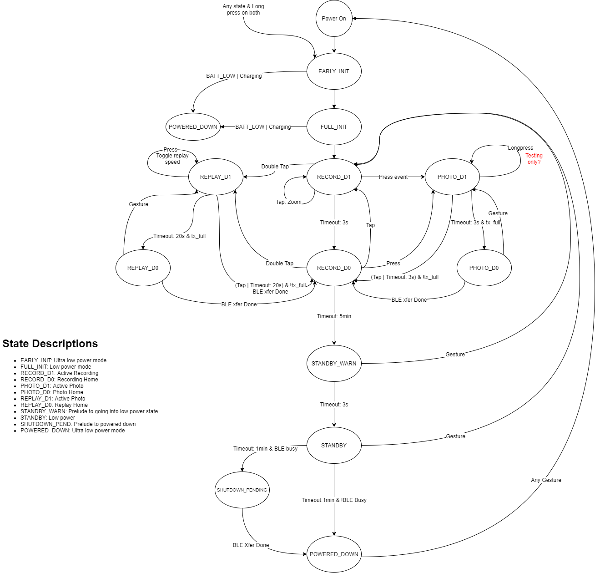
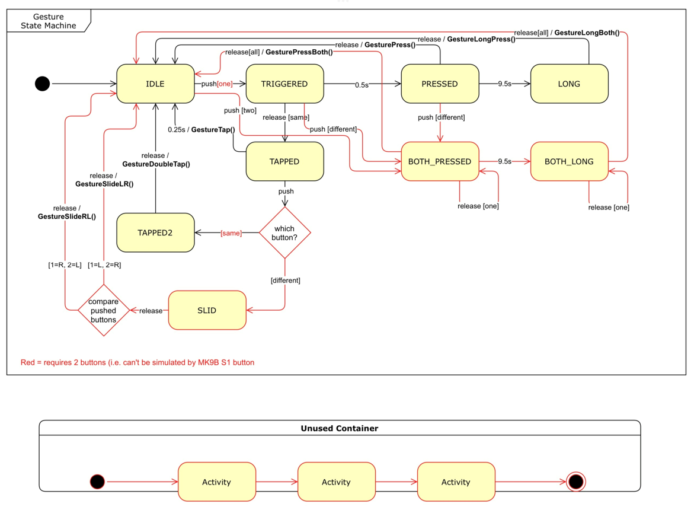

Firmware Architecture
=====================

This section describes about how is the software developed for monocle, various events that monocle software should handle and the Internal statemachine.

Monocle Firmware State Machine
------------------------------

Monocle Gesture Events 
----------------------

Data structure
--------------
1. Events to be Handled are mentioned below:

::

   MONOCLE_EVENT_G_TAP
   MONOCLE_EVENT_G_DOUBLE_TAP
   MONOCLE_EVENT_G_PRESS
   MONOCLE_EVENT_G_LONGPRESS
   MONOCLE_EVENT_G_LONGBOTH
   MONOCLE_EVENT_TIMEOUT
   MONOCLE_EVENT_BATT_LOW
   MONOCLE_EVENT_BATT_CHARGE
   MONOCLE_EVENT_BLE_CONNECT
   MONOCLE_EVENT_BLE_DISCONNECT
   MONOCLE_EVENT_BLE_TRANSFER_DONE

2. States of Monocle Firmware.

::

    MONOCLE_EARLY_INIT
    MONOCLE_FULL_INIT
    MONOCLE_POWERED_DOWN
    MONOCLE_SHUTDOWN_PENDING
    MONOCLE_RECORD_D1
    MONOCLE_RECORD_D0
    MONOCLE_PHOTO_D1
    MONOCLE_PHOTO_D0
    MONOCLE_REPLAY_D1
    MONOCLE_REPLAY_D0

3. monocle_state variable in main.c represents the current state of monocle firmware.
