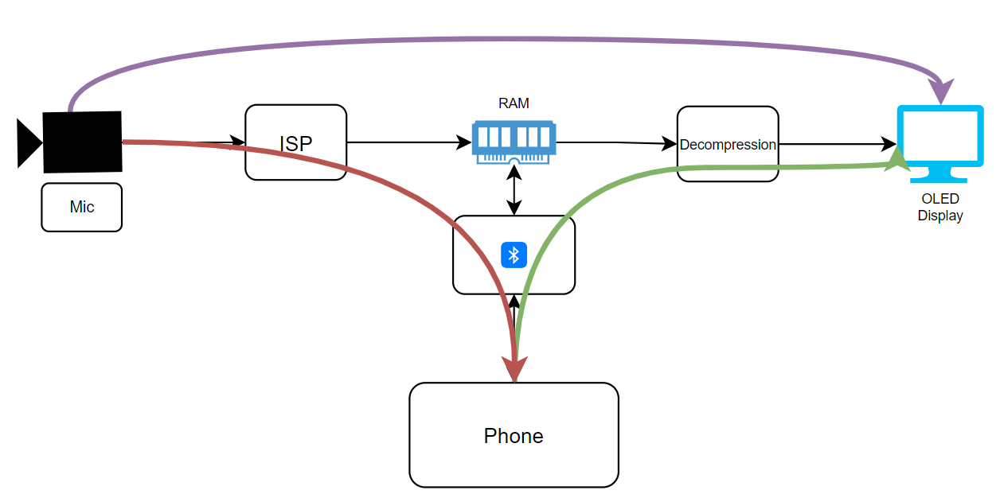

Hardware Specification
======================

Evolutions of Monocle hardware:

* `MK11 <https://raw.githubusercontent.com/Itsbrilliantlabs/monocle-boards/main/Monocle%20main%20board%20v1.0.pdf>`_
* `MK12` - **Currently in production**, with the same schematic but improved PCB routing.

.. figure:: images/block_diagram.png

  *Hardware Block Diagram of Monocle*

* MCU: `NRF52832 <https://www.nordicsemi.com/products/nrf52832>`_
* FPGA: `Gowin GW1NR-LV9 <https://www.gowinsemi.com/en/product/detail/46/>`_

Hardware Features
-----------------

#. The data path of Camera and Mic is connected to FPGA and the output stored in SRAM. This is done infinitely from Monocle Bootup till monocle sleeps.
#. If any Touch event is detected, MCU commands FPGA to freeze the Frame buffer and Audio buffer stored in SRAM and queries the Frame to Transfer through BLE and/or Display the image to OLED.

   *Monocle Data Flow Diagram*

The video and audio is always captured by Monocle.

#. Tap -> Displays live video
#. Press -> Captures Photo and sent to Phone.
#. Double Press -> Replays video, Transfers the existing video to the phone.

There are other features like, Slow-motion replay and Zoom in functionality as well.
